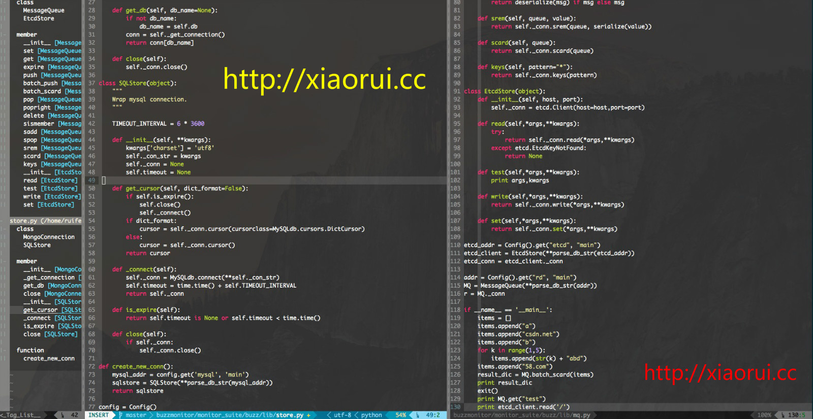

# python-vim

python vim环境包的安装方法:

更新vim相关插件，是为了解决一些不兼容的问题。

```
sudo yum clean all
sudo yum -y update vim
sudo yum -y install epel-release
sudo yum -y install ctags
```

下载我这边打包好的 .vimrc .vim .bashrc   , 含有一些常用的插件,主题 , 组件。

github方式安装:
```
cd ~
mv .vim .vim_bak
mv .vimrc .vimrc_bak
mv .bashrc .bashrc_bak
git clone https://github.com/rfyiamcool/python-vim.git
cd python-vim
\mv * ~
vim test.py
```

http方式安装:
```
sudo wget xiaorui.cc/vim_dev.tar.gz
 
sudo tar zxvf vim_dev.tar.gz
```

安装powerline-status用来做vim标记状态。

```
sudo pip install powerline-status
```
 
下面是shell的提示状态，如果不想让shell有炫目的powerline主题，那么就不用执行下面的命令。 
``` 
. /usr/local/lib/python2.7/site-packages/powerline/bindings/bash/powerline.sh
```


效果图:



